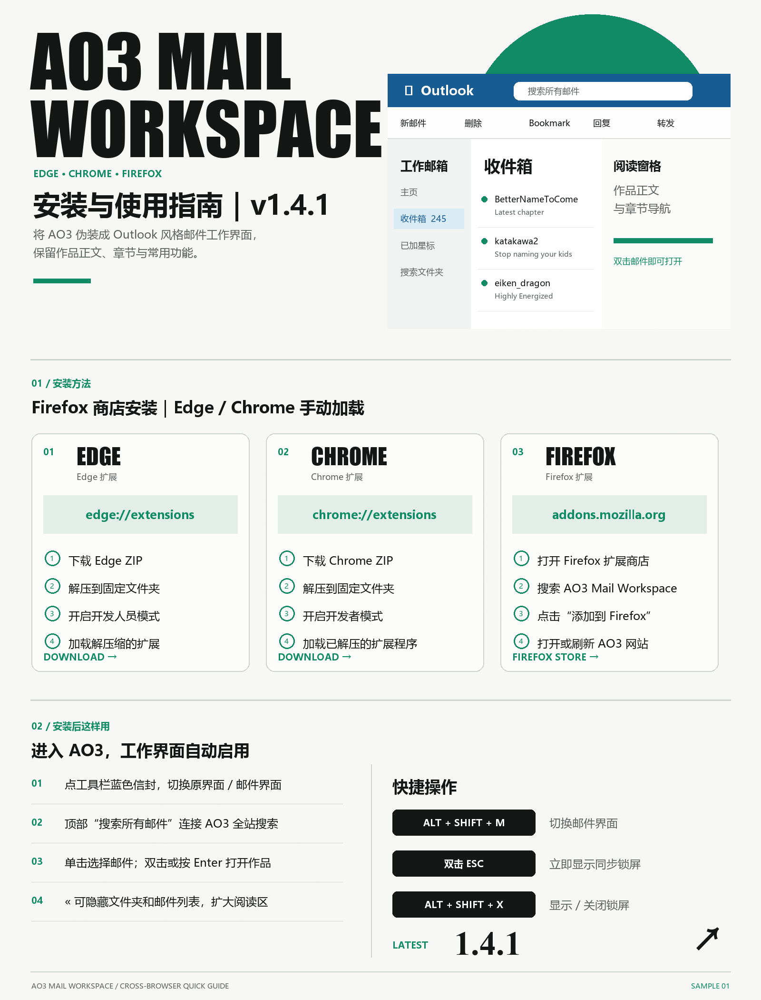

# AO3 Mail Workspace

把 [Archive of Our Own（AO3）](https://archiveofourown.org/) 显示成类似 Outlook 的邮件工作界面，同时保留作品正文、章节导航及常用 AO3 功能。

## 最新版本：v1.4.1

> Firefox 用户无需下载 ZIP 或使用临时调试模式，直接在 Firefox 扩展商店搜索 **AO3 Mail Workspace** 即可安装。

[Firefox 扩展商店安装](https://addons.mozilla.org/firefox/addon/ao3-mail-workspace/) · [下载 Edge / Chrome v1.4.1](https://github.com/melone411/ao3-mail-workspace-firefox/releases/tag/v1_4_1)

## Firefox 安装方法

1. 打开 [Firefox 扩展商店中的 AO3 Mail Workspace](https://addons.mozilla.org/firefox/addon/ao3-mail-workspace/)，或在扩展商店搜索 **AO3 Mail Workspace**。
2. 点击 **“添加到 Firefox”**。
3. 在确认窗口中点击 **“添加”**。
4. 打开或刷新 [AO3](https://archiveofourown.org/) 页面，邮件工作界面会自动启用。

### 将按钮固定在 Firefox 工具栏

1. 点击浏览器右上角的拼图按钮。
2. 找到 **AO3 Mail Workspace**。
3. 点击右侧齿轮，选择 **“固定到工具栏”**。

## Edge 安装方法

1. 下载 [`ao3-workspace-edge-v1_4_1.zip`](https://github.com/melone411/ao3-mail-workspace-firefox/releases/download/v1_4_1/ao3-workspace-edge-v1_4_1.zip)。
2. 将 ZIP **完整解压**到一个固定文件夹；安装后不要删除或移动这个文件夹。
3. 在 Edge 地址栏输入 `edge://extensions`。
4. 打开左侧的 **“开发人员模式”**。
5. 点击 **“加载解压缩的扩展”**。
6. 选择包含 `manifest.json` 的扩展文件夹。
7. 打开或刷新 AO3 页面。

## Chrome 安装方法

1. 下载 [`ao3-workspace-chrome-v1_4_1.zip`](https://github.com/melone411/ao3-mail-workspace-firefox/releases/download/v1_4_1/ao3-workspace-chrome-v1_4_1.zip)。
2. 将 ZIP **完整解压**到一个固定文件夹；安装后不要删除或移动这个文件夹。
3. 在 Chrome 地址栏输入 `chrome://extensions`。
4. 打开右上角的 **“开发者模式”**。
5. 点击 **“加载已解压的扩展程序”**。
6. 选择包含 `manifest.json` 的扩展文件夹。
7. 打开或刷新 AO3 页面。

### 将按钮固定在 Edge / Chrome 工具栏

点击浏览器右上角的拼图按钮，在扩展列表中找到 **Mail Workspace**，再点击旁边的图钉。固定后可随时点击蓝色信封按钮切换界面。

## 安装后如何使用

- 进入 AO3 后，邮件工作界面会自动启用。
- 点击工具栏中的蓝色信封图标，可切换原始 AO3 与邮件工作界面。
- 顶部 **“搜索所有邮件”** 会跳转至 AO3 全站作品搜索。
- 单击邮件可选中，双击邮件或按 `Enter` 可打开作品。
- 收件箱右上角的 `«` 可隐藏文件夹和邮件列表，扩大阅读区域。
- `EN / 中文` 可切换界面语言。
- 页面右上角的 **“恢复 AO3”** 可立即返回原始界面。

### 快捷键

| 快捷键 | 功能 |
| --- | --- |
| `Alt + Shift + M` | 切换邮件工作界面 |
| `Alt + Shift + X` | 显示或关闭同步锁屏 |
| 快速按两次 `Esc` | 立即显示同步锁屏 |

## 主要功能

- Outlook 风格的顶部栏、工具栏、文件夹、邮件列表和阅读窗格。
- AO3 作品、搜索结果、Bookmark、系列与 History 条目以邮件形式显示。
- History 支持增量读取全部分页，并使用本地缓存及失败重试。
- 邮件列表支持上一页、下一页、筛选、单击选择及双击打开。
- 侧栏对应 AO3 用户面板，并显示 AO3 提供的真实计数。
- Bookmark、History 删除、Mark for Later、评论、转发链接及 RSS 等操作对应 AO3 原生功能。
- 支持中英文界面、阅读进度、真实已读状态和最小化阅读布局。
- 支持手动同步锁屏，并可选择失焦时自动锁定。
- 标签页标题与图标会随工作界面切换，关闭后自动还原。

## v1.4.1 更新内容

- 修复侧栏底部图标栏覆盖中间文件夹的问题。
- 修复英文界面悬停时 AO3 原名不显示的问题。
- 缩短三个过长的英文译名，减少侧栏文字被截断。
- 仓库根目录源代码已同步至 v1.4.1。

## 文件说明

- `manifest.json`：Firefox 扩展配置。
- `content.js`：页面接管、阅读记录、锁屏、History 抓取与分页逻辑。
- `skins.js`：邮件工作界面结构及文案。
- `mail-workspace.css`：界面及 AO3 阅读样式。
- `background.js`：工具栏按钮与快捷键。
- `icons/mail.svg`：扩展图标。

## 隐私

扩展只在 `archiveofourown.org` 域名下运行，不连接第三方服务，也不收集或上传用户数据。界面设置、阅读记录和分页缓存仅保存在浏览器本地。

## 许可证

[MIT License](LICENSE)
